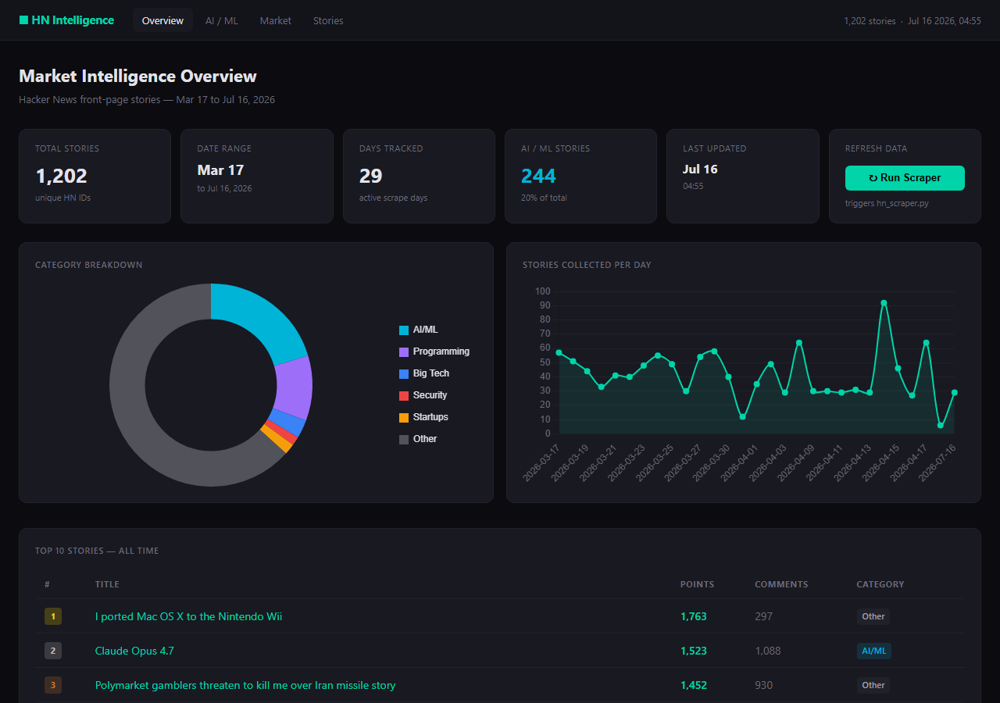

# HN Market Intelligence

A Hacker News front-page scraper and analytics dashboard for tracking AI-industry mindshare and community engagement over time — built for anyone who wants a running, queryable history of what HN's front page actually looked like, not just what it looks like right now.

## The problem it solves

The HN front page is a moving target — stories rotate off within hours. There's no built-in way to ask "how has 'agent' mentions trended over the last month" or "which company dominated AI coverage in March." This project answers that by capturing the front page repeatedly over time into one queryable archive, then giving it a dashboard instead of a raw CSV.

## Screenshot



*(Live data — 1,202 unique stories at time of writing, spanning Mar 17 – Jul 16, 2026. This will keep growing every time the scraper runs.)*

## Quickstart

```bash
pip install -r requirements.txt
python web_dashboard.py
```

Open `http://localhost:5001`. Verified from a clean environment — `pip install` then `python web_dashboard.py` boots and serves real data from the committed `hn_archive.csv` with no further setup.

## How it works

- `hn_scraper.py` hits the official Hacker News Firebase API (`hacker-news.firebaseio.com`) for the current top 30 story IDs, fetches each item, and appends new ones to `hn_archive.csv`. It never re-fetches a story it's already recorded (tracked by HN's own story ID).
- Titles are categorized by a keyword-regex pass (`CATEGORY_RULES`) into AI/ML, Programming, Big Tech, Security, Startups, or Other — no ML classifier, just pattern matching, and it's honest about that.
- `web_dashboard.py` is a single-file Flask app. It loads the CSV once, keeps the **highest-points snapshot per story** (a story's points/comments change every time it's re-scraped while still on the front page — `load_stories()` in `web_dashboard.py:38-62` — so the dashboard shows each story's best-known state, not a random one), and caches that in memory until the next scrape.
- Four views (Overview, AI/ML Deep Dive, Market Intelligence, Stories Browser) plus two JSON endpoints (`/api/stats`, `/api/stories`) all read from that same in-memory dataset.
- Clicking **Run Scraper** on the dashboard calls `POST /api/refresh`, which shells out to `hn_scraper.py` with a 120-second timeout and clears the cache on success.

## Running on a schedule

`scheduler.py` runs `scrape()` on an interval, in the foreground:

```bash
python scheduler.py                # every 60 minutes (default)
python scheduler.py --minutes 30   # custom interval
python scheduler.py --once         # single run, then exit
```

This only collects data while the process is running — closing the terminal or shutting down the machine stops it, same as any foreground script. For real unattended collection, wire `python scheduler.py --once` into your OS's own scheduler instead: **Windows** → Task Scheduler, action "Start a program," daily/hourly trigger; **Linux/Mac** → `crontab -e`, e.g. `0 * * * * cd /path/to/hn_archiver && python scheduler.py --once`.

## Design decisions

**The `/api/refresh` subprocess boundary.** (`web_dashboard.py:843-859`) A naive "refresh" button would just call the scraper's Python function in-process. Instead it shells out via `subprocess.run` with a hard 120-second timeout, and truncates stdout/stderr to the last 500/300 characters before returning them in the JSON response. That means a hung or unexpectedly noisy scraper run can't hang the HTTP request or dump an unbounded blob back to the browser — the failure is contained and bounded either way.

**Keeping the best snapshot, not the latest one.** (`web_dashboard.py:53` — `if hn_id not in best or row['points'] > best[hn_id]['points']`) Because the same story gets re-scraped repeatedly while it's still on the front page, a naive "last write wins" dedup would show whatever points/comments happened to be current at the last scrape before the story fell off — often an undercount. Keeping the max-points snapshot per story means the dashboard reports each story's peak reach, which is the number that's actually meaningful for "how big did this get."

## Known limitations

- **The category classifier is keyword regex, not ML.** A story titled "Anthropic's new security research" tags as Security before AI/ML, because the regex checks categories in a fixed order and stops at the first match. Fine for a portfolio dashboard, not a real taxonomy.
- **No automated tests.** `hn_scraper.py` and `web_dashboard.py` have zero test coverage — nothing here is unit-tested.
- **Not deployed anywhere.** Runs locally only (`localhost:5001`); no Docker/hosting config exists.
- **The raw archive had ~2,067 duplicate rows from an earlier scraper version** (same story recorded multiple times as its points changed, before a cleaner one-fetch-per-ID version existed) — cleaned up (3,240 → 1,173 rows) as part of this pass. The dashboard's `load_stories()` already tolerated the duplicates gracefully (kept the best snapshot regardless), so this was a data-hygiene fix, not a correctness bug in what the app displayed.

## API

### `GET /api/stats`
Live numbers as of this writing (will drift as the scraper keeps running):

```json
{
  "total_stories": 1202,
  "date_range": { "from": "2026-03-17T09:45:00", "to": "2026-07-16T04:55:53" },
  "categories": { "AI/ML": 244, "Programming": 125, "Big Tech": 35, "Security": 17, "Startups": 21, "Other": 760 },
  "keyword_frequency": { "Claude": 36, "Agent": 42, "OpenAI": 7, "Anthropic": 5, "GPT": 7, "RAG": 8, "LangChain": 0 },
  "top_10": [ ... ]
}
```

### `GET /api/stories`
Paginated, filterable story list.

| Param | Description |
|---|---|
| `q` | Title keyword search |
| `cat` | Category filter |
| `pts` | Minimum points |
| `dfrom` / `dto` | Date range (YYYY-MM-DD) |
| `sort` | `points` · `comments` · `date` · `rank` |
| `limit` | Max results (≤ 200, default 50) |
| `offset` | Pagination offset |

### `POST /api/refresh`
Triggers `hn_scraper.py` via subprocess (120s timeout), then clears the in-memory cache so the next page load reflects new data.

## Project Structure

```
hn_archiver/
├── hn_archive.csv       # Collected data (1,202 unique stories as of this writing)
├── hn_scraper.py        # Data collection script
├── scheduler.py         # Optional: runs the scraper on an interval
├── web_dashboard.py     # Flask dashboard (single file, self-contained)
├── requirements.txt
└── README.md
```

## Author

Zayed Zaidan · AI Engineering student · [GitHub](https://github.com/zayed971)
